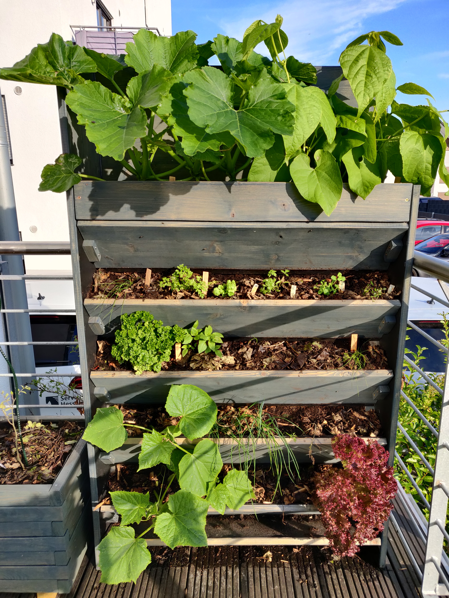
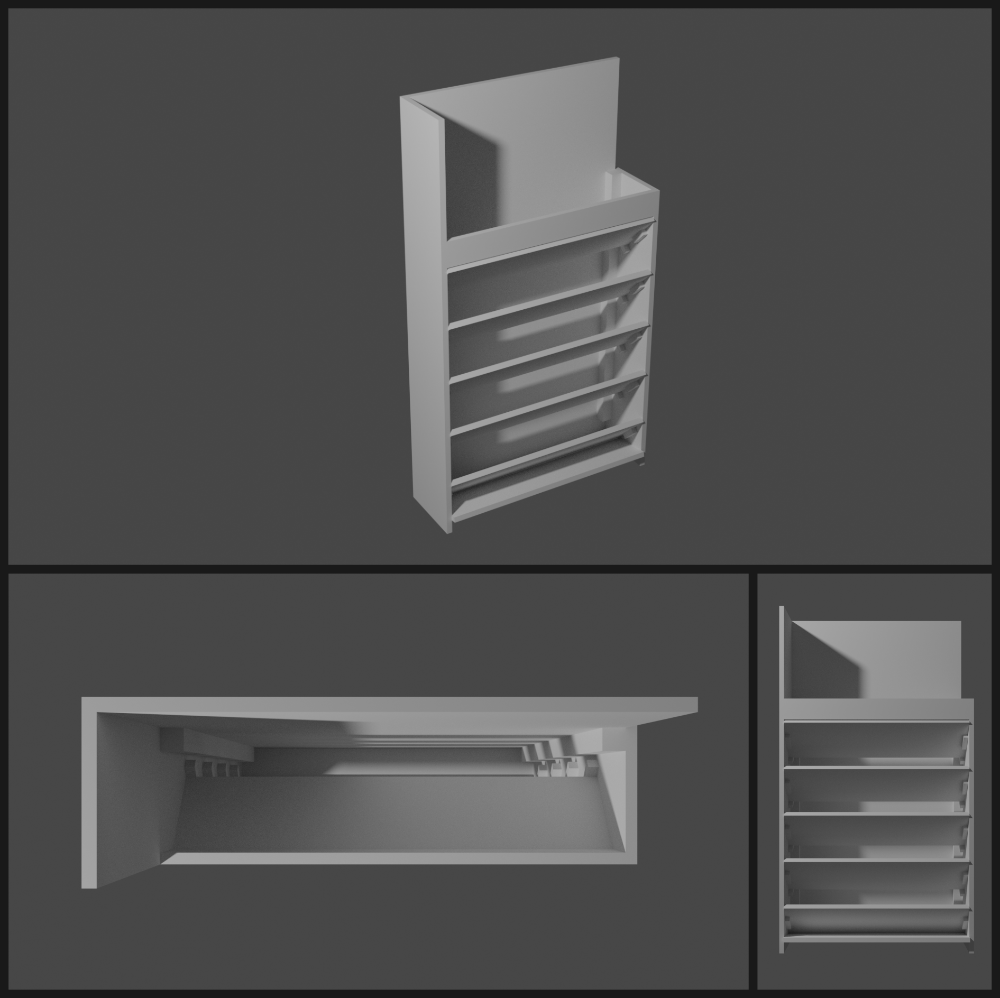
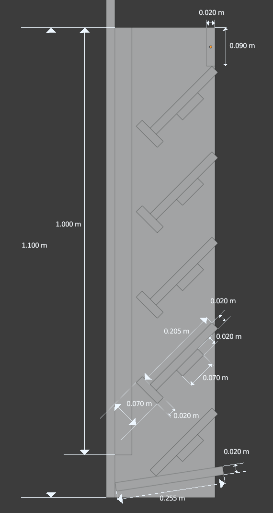
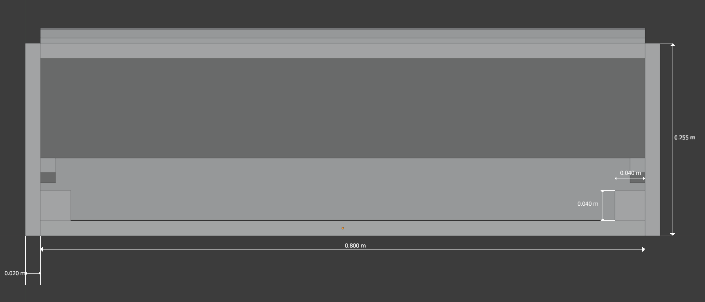
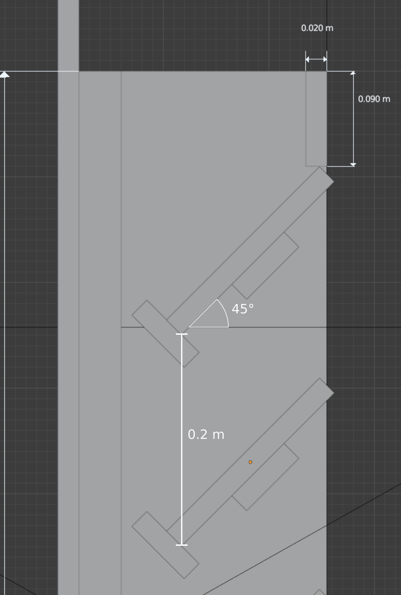
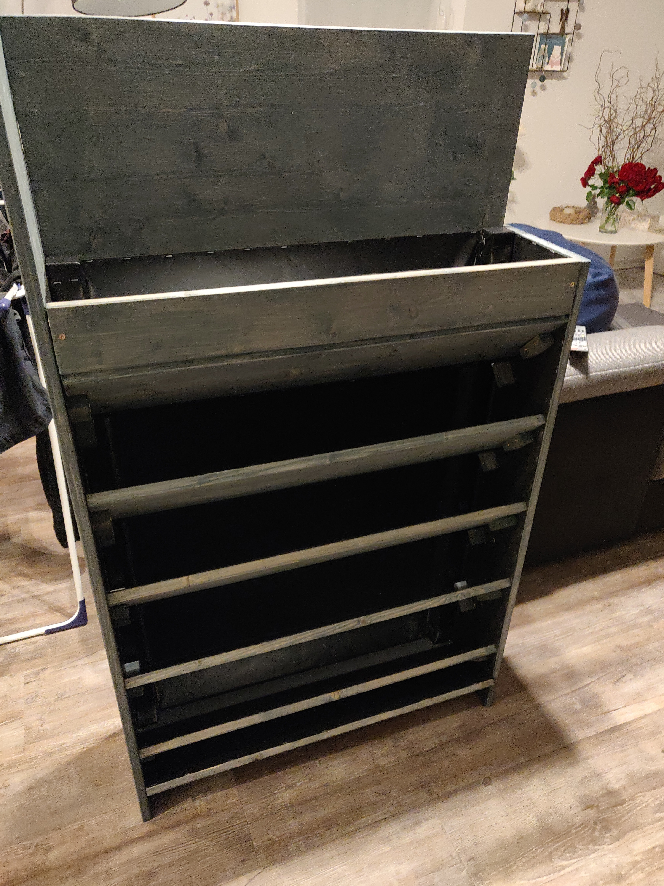

# Open Vertikalbeet
Dieses Vertikalbeet eignet sich, um Platz auf dem Balkon nutzbar zu machen, oder eine Wand zu begrünen. 
Durch den vertikalen Aufbau wird nur minimale Grundfläche benötigt, bei gleichzeitig hoher Wuchsfläche.
Außerdem sorgt er dafür, dass die Sonneneinstrahlung optimal genutzt wird. 
Im Vergleich zu vielen anderen Vertikalbeeten, die man fertig kaufen kann, verfügt dieses Beet über einen durchgehenden Erdkörper.
Dadurch finden die Pflanzen genug Platz um tief zu wurzeln.
Durch die eingeschobenen Böden wird das Befüllen und der Wechsel des Erdköpers vereinfacht.

Der Entwurf kann flexibel angepasst werden. Beispielweise kann die Breite variiert werden, oder die Höhe und damit die Anzahl der Einschübe.

*Bewachsenes Beet*

*3D-Rendering des Beetes*

## Bevor es losgeht
Es werden verschiedene Materialien und Werkzeuge benötigt. Optionales ist *kursiv* dargestellt.
Das Holz kann frei gewählt werden, sollte aber widerstandsfähig sein, wenn keine Teichfolie eingesetzt wird. Dazu bieten sich Douglasie oder Lärche an. Fichte geht auch, ist allerdings nicht ganz so widerstandsfähig.
In unserem Beispiel haben wir lackiertes Fichtenholz benutzt, vor allem weil es das günstigste und am einfachsten zu beschaffende Holz war.

Die Rückwand und eine Seitenwand wurden etwas höher gebaut um als Windschutz zu dienen.
Auf unserem Balkon kann der Wind stark durchziehen. Bei einem geschützten Balkon kann man die Rückwand und beide Seitenwände auf 1.1 m belassen.

Alle Platten haben eine Dicke von 2cm. Die Breite des Beetes beläuft sich laut diesem Vorschlag auf insgesamt 84cm, wenn mehr Platz vorhanden ist, können die Rückwand, die Einschübe und das obere und untere Brett natürlich auch breiter als 80cm gewählt werden.

### Materialien
#### Holz
* **Rückwand:** 1.1m x 0.8m insgesamt, können aber einzelne Platten sein, die werden mit einem Kantholz verbunden werden (*1.5m wenn Windschutz benötigt*)
* **Klötzchen der Einschübe:** Vierkant Holz 0.02x0.02x2 m
* **Befestigung Rück- und Seitenwande:** Kantholz 0.04x0.04x2 m
* **Seitenwände:** 2.2x0.255 m (*Je nach Windschutzbedarf auch höher*)
* **Einschübe:** 5 Bretter â 0.8x0.205 m
* **Unterstes Brett:** 0.8x0.24 m
* **Oberstes Brett:** 0.8x0.09 m

#### Sonstiges
* Schrauben (Längen: 5.5cm für Rück- und Seitenwände sowie für oberstes/unterstes Brett; 3.5cm für Klötze der Einschübe)
* 75l Hochbeeterde und 75l Hochbeetkompost
* *Teichfolie (2x2m)*
* *Tackernadeln*
* *Lack*
* *Schellen zur Geländerbefestigung (im Baumarkt im Sanitärbereich)*
### Werkzeuge
* Akkuschrauber
* Holzbohrer
* Säge, Stich- oder Kreissäge, zur Not geht's auch per Hand
* Böcke um auf einer angenehmen Höhe zu arbeiten
* Zollstock
* Bleistift
* Geodreieck
* *Pinsel*
* *Abdeckvlies*
* *Tacker für die Teichfolie*
* *Messer für die Teichfolie*
## Aufbau
Optionale Schritte sind *Kursiv* dargestellt.

Ansicht mit Maßen von der Seite ohne die Seitenwand.

Ansicht von Oben mit Maßen.

Detailansicht der Einschübe von der Seite mit Maßen.

### Vorbereitung
1. 24 Klötze für Einschübe und oberes/unteres Brett auf 7cm Länge sägen
2. Seitenwände auf Länge sägen
3. Kantholz auf Länge sägen
4. Klötze vorbohren, 2 Löcher pro Klotz für die Schrauben später
5. *Lackieren*

### Montage
1. Kantholz an Rückwände schrauben
2. *Teichfolie an Rückwand um die Kanthölzer tackern*
3. *Teichfolie an Seitenwände*
4. *Teichfolie an Einschübe und oberes Brett, allerdings nur eine Seite*
5. Klötze für Einschübe und das oberste sowie das unterste Brett an die Seitenwand schrauben, hierbei hilft es die Einschübe einzuzeichnen und die Position er Klötze davon abzuleiten
6. Seitenwände und Rückwand verschrauben
7. Unteres und oberes Brett verschrauben
8. 4 Löcher in die Rückwand bohren etwas oberhalb des untersten Bretts, um als Ablauf zu dienen
9. *Geländerbefestigung anbringen*
10. Erde 50:50 mischen
11. Erde von unten nach oben einfüllen und dabei die Einschübe anbringen

Ungefüllt sieht das Beet dann so aus.

## Lage und Bewuchs
Als Standort wird optimalerweise die Fläche mit den meisten Sonnenstunden gewählt. 3-4 Sonnenstunden sollten es mindestens am Tag sein, die Nordseite sollte vermieden werden.
Der Bewuchs ist abhängig von der Saison, es sollte aber darauf geachtet werden, dass nicht zu große Pflanzen gewählt werden.

Bei der Positionierung der Pflanzen innerhalb des Vertikalbeetes sollte man auf zwei Sachen achten:
* Gegenseitige Abschattung, die Pflanze sollte nicht mit den Blättern die unteren Pflanzen abschatten.
* Licht- und Feuchtigkeitsbedarf, oben auf dem Beet ist am meisten Sonne und am trockensten, während es unter feuchter und schattiger ist. 

Außerdem sollten Pflanzen gewählt werden, die öfter beerntet werden können, wie Kräuter, Pflücksalat, Erdbeeren, usw.

# Mitwirken und Verbesserungen
Jeder ist dazu eingeladen beizutragen, um nach und nach den Entwurf des Vertikalbeetes zu verbessern, den Aubau zu vereinfachen und den Bewuchs bzw. den Ertrag zu optimieren. Für Verbesserungsvorschläge oder Anmerkungen gerne einen Issue oder gleich einen Pull Request erstellen. Offene Ideen:
* Automatische Bewässerung
* Sammlung an Pflanzen und Standort anlegen

## Links
* [Buch: Hände in die Erde](https://www.goodreads.com/book/show/49446021-h-nde-in-die-erde?from_search=true&from_srp=true&qid=78vGdwPepJ&rank=1)

Englische Übersetzung folgt...
